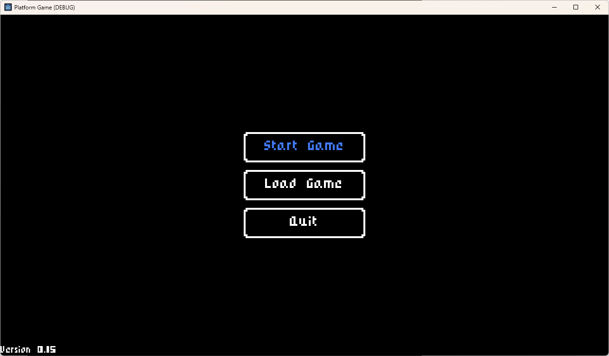
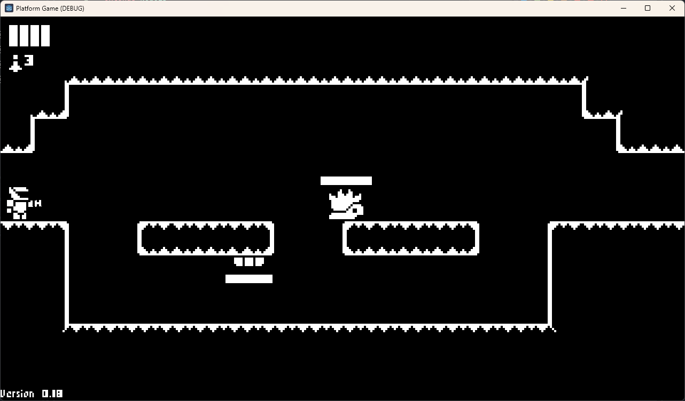
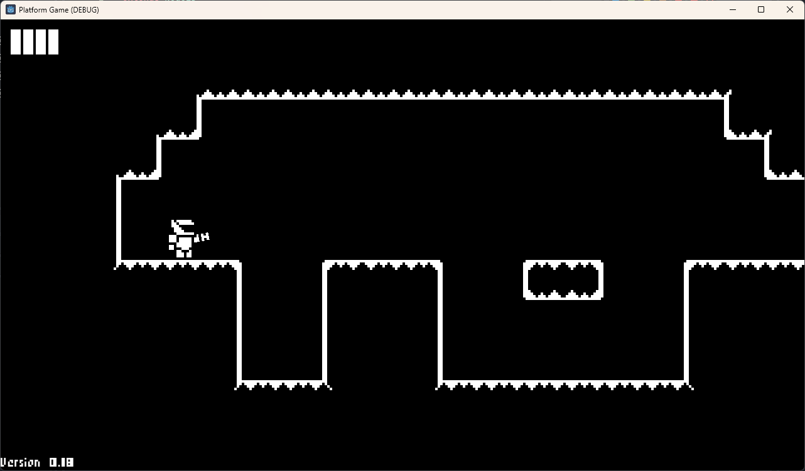
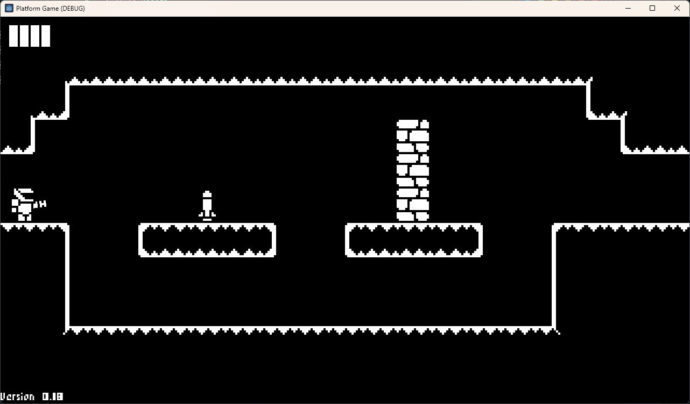
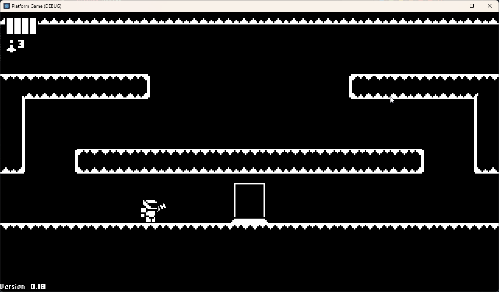
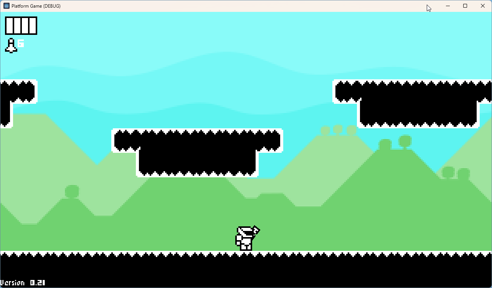
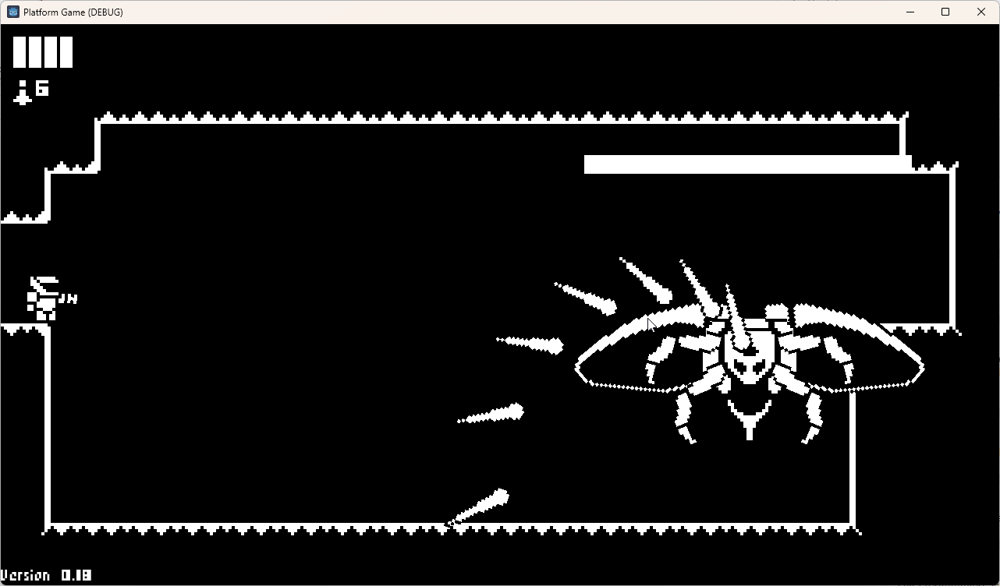
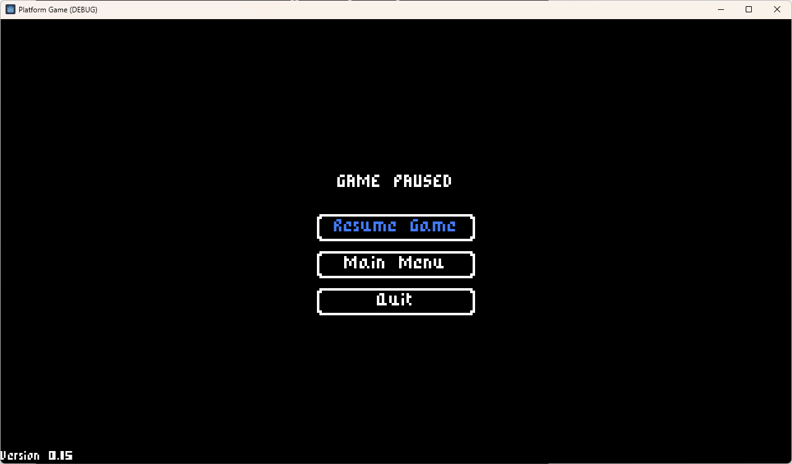
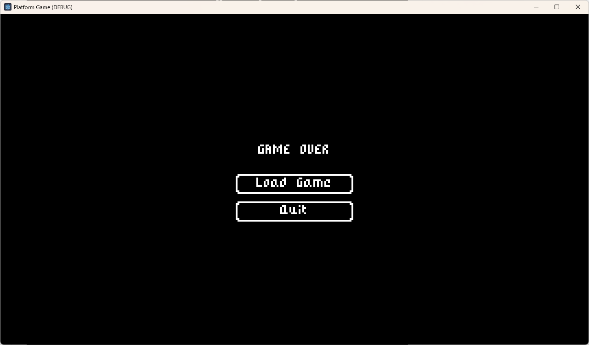

# Platform Game
This project is based on the [1-Bit Godot 4 Course](https://courses.heartgamedev.com/p/1-bit-godot-4-course) from [Heartbeast](https://www.youtube.com/c/uheartbeast).

Playable under https://jonass5.github.io/PlatformGame/

## Start menu

## Tutorial levels allow to learn the controls

## Level 2

## Level 3

## Entrance Hall allow to choose different areas

## Jungle is one of the areas

## Boss fight in the jungle

## Pause menu

## Game Over menu

